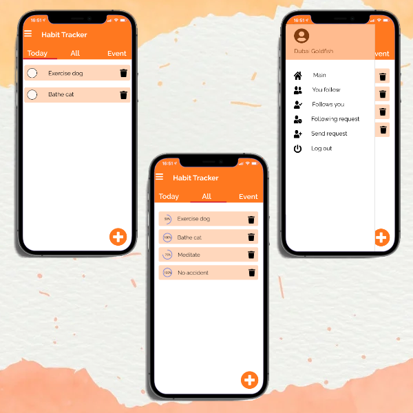

  
# Android Habit Tracker

 

---

## Contents
* [About](#about)
* [Specifications](#specifications)
* [Usages](#usages)
* [Notes](#notes)
* [References](#references)

---

## About
Android Habit Tracker - Collaborative Task Management Android Application	
- Led a team of 5 students to develop an Android habit tracker app from concept to release.
- Efficiently managed project timelines, resulting in 100% completion rate of project tasks.
- Organized weekly team meetings, ensuring consistent communication on project status and individual contributions.

---

## Specifications
- Google Firebase as backend.
- Documentation is located in the [Wiki](https://github.com/haicanberra/Habit-Tracker/wiki).

---

## Usages
- Install Android Studio.
- Go to Build > Build Bundle(s) / APK (s) > Build APK(s).
- Install and run the apk on your device.
- Sign up and login!

---

## Notes
- The database expired on Firebase so online sync might not work.
- Todo: Compile and release.
---

## References
- Forked from original [repo](https://github.com/CMPUT301F21T39/Recurring-O-City).
